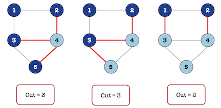

# Maximum Cut

Here we explore the maximum cut problem.  This problem has a wide
variety of real-world applications.

For example, suppose that we have a set of different computers, each with
different types of connections.  Some computers have bluetooth, some have USB
ports, HDMI ports, etc.  We want to split our set of computers into two groups
for two different projects, but it's very important that the two groups can
connect to each other.  The problem is sometimes the wires and connections don't
work!  How can we be sure that we have the best chance at remaining connected?

One way to solve this problem is with the maximum cut problem.  If we think of
our set of computers as a graph (a node/vertex for each computer), and draw an
edge between computers that can connect to each other, we have a model of our
network.  If we look for a maximum cut in our graph, then we are looking for a
way to split the nodes into two groups so that there are as many edges as
possible between the groups.  In our computer set, this means that we have two
groups with as many connections as possible between the two groups.  Now if one
connection goes down, we have many more to use!  This way we have created a more
resilient network by providing many redundant connections between groups in case
one connection fails.

Below we see a simple network of five nodes and three different ways to split
the set of nodes into two groups.  The red edges in each graph highlight the cut
edges.



We will run the maximum cut problem on the network shown above to find the best
way to split the network into two groups to maximize the number of cut edges.

## Usage

To run the code, type:
```bash
python main.py
```

After running, output will be printed to the command line that provides a list
of nodes in each set (labeled sets S0 and S1), the energy corresponding to the
given solution, and the cut size of the given solution. In addition, there will
be a visual of the lowest energy solution stored in `maxcut_plot.png`.

## Code Overview

The code implements a QUBO formulation of this problem.

The answer that we are looking for is a partition of the nodes in the graph, so
we will assign a binary variable for each node, i.e. variable x_i denotes
whether node i is in one subset (call it Subset 0) or the other (Subset 1).

The objective function that we are looking to optimize is maximizing the number
of cut edges.  To count how many cut edges we have given a partition of the
nodes (assignment of our binary variables), we consider a single edge in a graph
in the table below.  We only want to count an edge if the endpoints are in
different subsets, and so we assign a 1 for the edge column in this case and a 0
otherwise.

| x_i   | x_j   | edge (i,j) |
| :---: | :---: | :---------:|
| 0     | 0     | 0          |
| 0     | 1     | 1          |
| 1     | 0     | 1          |
| 1     | 1     | 0          |

From this table, we see that we can use the expression x_i+x_j-2x_ix_j to
calculate the edge column in our table.  Now for our entire graph, our objective
function can be written as shown below, where the sum is over all edges in the
graph.


Since our system is used to minimize an objective function, we must convert this
maximization problem to a minimization problem by multiplying the expression by
-1.  Our final QUBO expression is the following.


For the graph shown above, this QUBO results in the following Q matrix.  In the
Q matrix (implemented as a dictionary using Ocean), we put the coefficients on
the linear terms in our QUBO along the diagonal and the quadratic terms on the
off-diagonal.

|     | x_0 | x_1 | x_2 | x_3 | x_4 |
|:---:|:---:|:---:|:---:|:---:|:---:|
| x_0 | -2  | 2   | 2   | 0   | 0   |
| x_1 | 0   | -2  | 0   | 2   | 0   |
| x_2 | 0   | 0   | -3  | 2   | 2   |
| x_3 | 0   | 0   | 0   | -3  | 2   |
| x_4 | 0   | 0   | 0   | 0   | -2  |

In the code, we create this Q matrix, looping over
the edges in our graph just as we see in the summation of our QUBO expression.


## References

Dunning, Iain, Swati Gupta, and John Silberholz. "What works best when? A
systematic evaluation of heuristics for Max-Cut and QUBO." INFORMS Journal on
Computing 30.3 (2018): 608-624.

## License

Released under the Apache License 2.0. See [LICENSE](./LICENSE) file.
